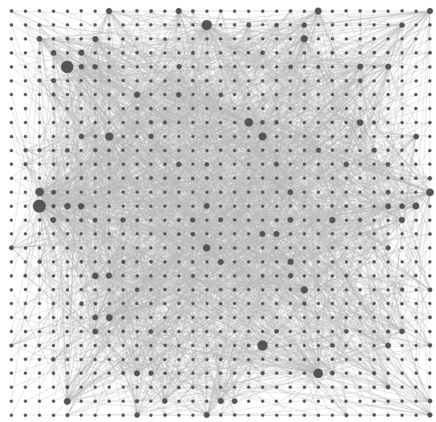

_Photo by jimmy teoh from Pexels_

I've wanted to learn functional programming for a while, and finding out about [Athens](https://github.com/athensresearch/athens) and their use of Clojure gave me the final push to finally open up my terminal and start fiddling around with the language. And here I wanted to write why I am intrigued by Athens, and a bit of what small amount of clojure that I've learnt.

## Second Brain and Athens

I've spent the last 2 month using [Roam Research](https://roamresearch.com/) to aid me in thinking and organize my private writing and journaling, also for a kind of CRM. And it works, i really love the interface, how the backlinking works, how satisfying to watch my knowledge graph visualized (even tho I haven't found it particularly useful for now), and I could go on and on about what I like about Roam.



Sadly there are a few things that gave me second thoughts to use roam as my [second brain](https://maggieappleton.com/basb/). From the fact that it's not an open source software, It's browser only, and I don't have the control on where my data lives (well it's not exactly a problem per se, but I'd like to have control over my data if I could help it. Fortunately Roam's export is quite versatile to enable [backup to git](https://github.com/MatthieuBizien/roam-to-git)). But what gave me the final push is last the recent announcement of Roam pricing. While there is free tier still available, but it makes me think is there any alternative besides Roam Research?

## Here comes Athens

Well to be fair, actually I found out and use [Obsidian](https://obsidian.md/) for now because it's [offline first](http://offlinefirst.org/) and works well together with git and practically free forever. With that out of the way, let's continue with Athens. Athens aims to be an open source networked thoughts tool, with [demo available](https://athensresearch.github.io/athens/). but the underlying [community on discord](https://t.co/N5zCq3EozJ?amp=1) is what sold me in.

The community not only talks about the development of athens itself, but also a lot of other channel that discuss about knowledge management in general, there are even a channel to discuss about Roam Research and Obsidian too! (Obsidian also has its own discord btw). The openness of Athens, together with it's constructive community made me want to contribute to the community in a way I found the most pleasure in, that is in making things.

Here's the catch, Athens' stack is built on top of Clojure. So if I wanted to contribute to the project itself, I need to learn clojure first.

## Motivation

Before deciding to learn clojure, I really gave it a lot of thoughts whether it worth the time investment or not. Here is several motivations that really fuels my decision:

1. I've read about clojure first from [Dagan's Blog](https://dragan.rocks/) and reading how he utilized clojure for a lot of machine learning studies really intrigue me on the utility of the language.

2. Since finding out about LISP in my university year I've wanted to learn more about functional programming and the concept itself, and here is a chance to at last have a concrete goal to learn it.

3. Of course because I wanted to contribute to the project itself :)

4. There's study group for this inside the community, its called clojurefam (TBH I always misread it as clojure__farm__ lol)

With those motivations I felt like it's enough reasons to start learning clojure myself :)

## My target and Where I currently at

Currently, I only just finished setting up my environment (using [Emacs and Cider](https://www.braveclojure.com/basic-emacs/) for editor and using [leiningen](http://leiningen.org/)) and also read a bit from chapter 3 of Brave Clojure. At least currently I know what the hello world looks like!

``` Clojure
(println "Hello World")
```

Currently my target is as follow:

> Finishing [Brave Clojure](https://www.braveclojure.com/do-things/) to understand the concept and exercise from [4Clojure](http://www.4clojure.com/) (at least 5 a day)

For the next 5 Week, those two main goals will be what I will strife to do daily. And I'll try to update my progress as time goes by. Or maybe I'll follow in the footstep of learning in public from my friend in clojurefam, we'll see!.
