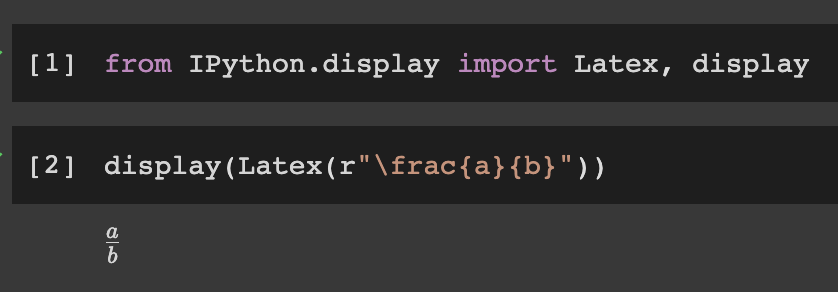
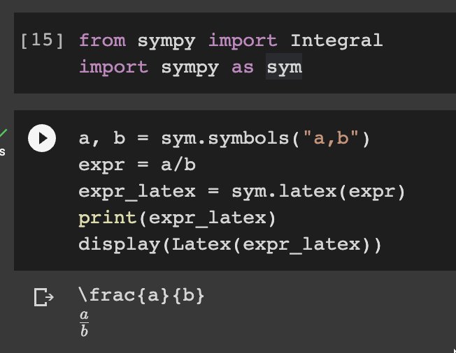
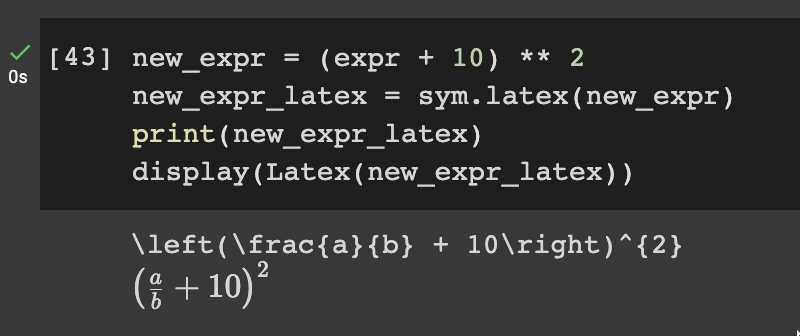
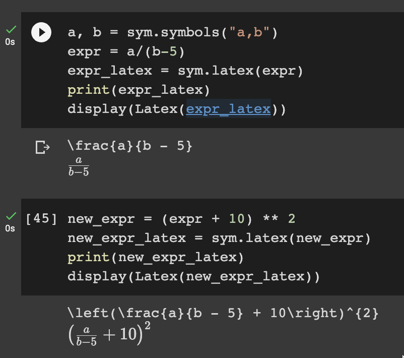
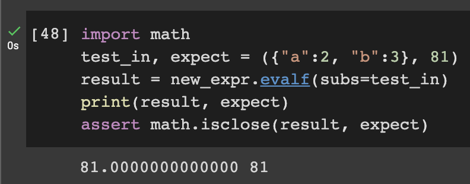

I've been writing Latex manually for a while, especially when working on a more scientifically-intensive notebook in python. While it's not that hard to do, sometimes it requires patience and detail. And today I learned that I could use python's [sympy](https://docs.sympy.org/latest) to alleviate some of the work. Usually I just do the following:

_how I usually use Latex in my notebook_

It's fine and for simple equation it works just fine. But what happened was:
- I wrote the equation incrementally to help explain what each part does
- For some cases I often rework earlier equation because it can help explainability or just plain wrong
- I need to check whether the equation makes sense

And writing plain latex doesn't help those three problems. So I'm excited when finding out that I could write the equation in sympy and render it as Latex.

_writing the equation in sympy to be rendered as latex_

As mention above, it has added benefit of composability of sympy, so that I could add to the previous equation.

Also by incorporating the equation into python script, I could change the earlier equation and have it propagated down as needed without copy-pasting it[^1].

And lastly, I could ass to it a simple test or just and exploratory part to make sure that the equation matches my expectation.

I'm really looking forward to trying this out, especially in trying to understand concepts in Machine Learning, I may start from the simpler ones (like loss functions (MAE, MAPE, MSE, etc.) or just simple SGD).

[^1]: Actually it might be possible that Latex has similar feature, but I mainly work in python so.. yeah, that's my defense hahaha